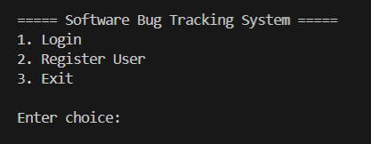
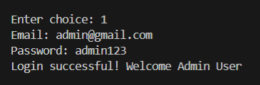
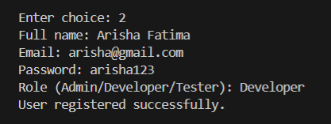
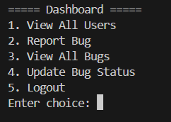
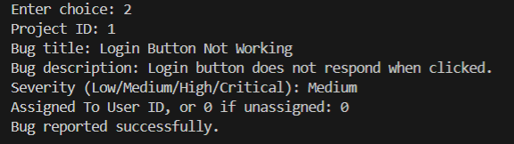
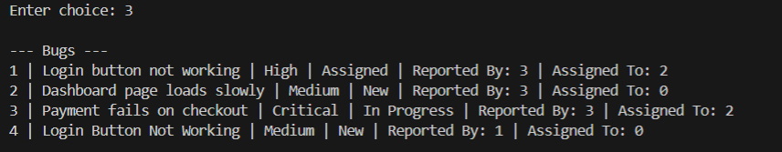

# Bug Tracking System

This project was developed as part of my Java learning journey. It is a console-based Bug Tracking System that allows users to register, log in, report software bugs, update their status, and manage bug records using a MySQL database.
## Screenshots

### Login Menu




### User Registration



### Dashboard



### Report Bug



### View All Bugs


## Technologies Used
- Java
- MySQL
- JDBC
- VS Code

## Project Structure
```
src/
├── dao/
├── database/
├── model/
├── Main.java

lib/
└── mysql-connector-j-9.7.0.jar

database_script.sql
README.md
```

## Database Setup
1. Start MySQL using XAMPP.
2. Create a database named `bug_tracking`.
3. Import the `database_script.sql` file.
4. Run the project from `Main.java`.

## Author
Arisha Fatima
